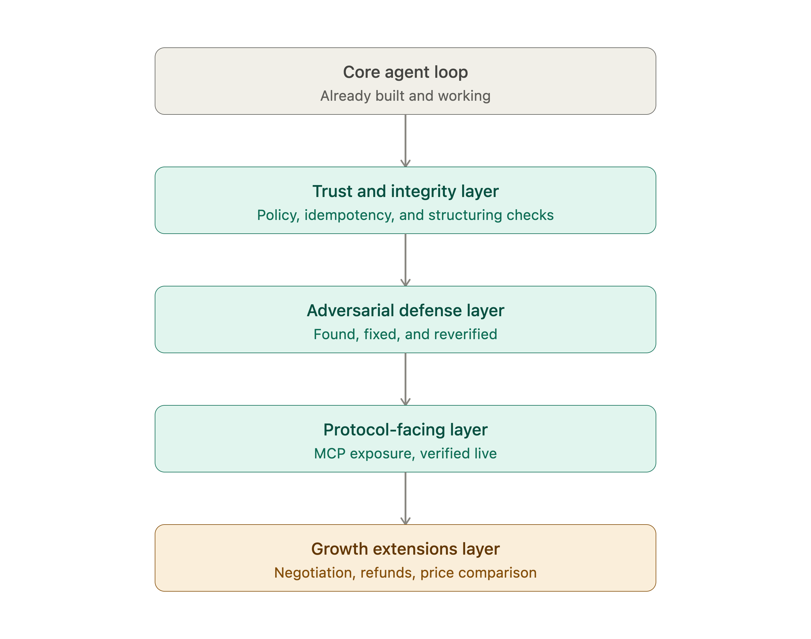
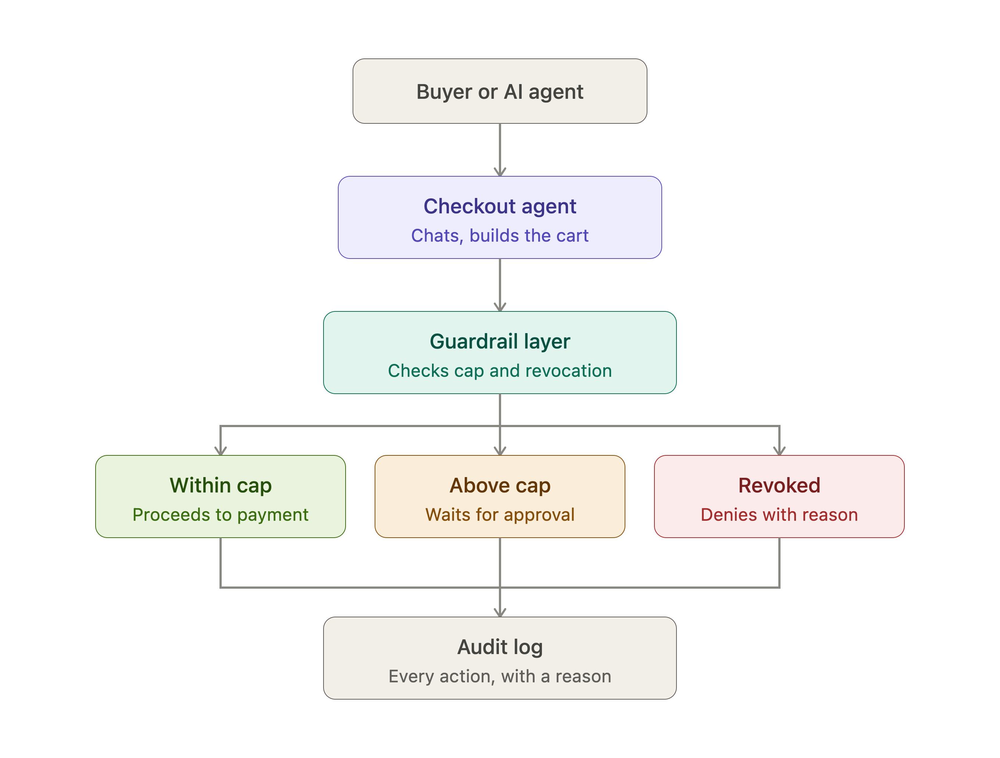

# Razorpay Checkout Agent

**Razorpay Checkout Agent — a bounded, explainable, gated AI checkout system for Razorpay's AI Growth & Agentic Commerce track.**

---

## What This Is

This project is a full-stack agentic checkout system built for the Razorpay buildathon's **AI Growth & Agentic Commerce** track, which has two distinct halves.

**Half one — the checkout agent:** "Ledger" is a Gemini-powered conversational checkout assistant that grows merchant revenue through natural-language shopping, AI-driven upsells, and bounded price negotiation. Every decision (approve, deny, negotiate, upsell) returns a human-readable reason and is written to a structured audit log before anything touches a payment API.

**Half two — the MCP server:** A [Model Context Protocol](https://modelcontextprotocol.io) server exposes the same merchant catalog and purchase operations as first-class MCP tools and resources, making the merchant transactable by any external AI agent — demonstrated live with Claude Desktop, which can browse the catalog and complete purchases through the MCP connection without any bespoke integration.

---

## The Bar, and How Each Part Is Met

| Track requirement | What's built |
|---|---|
| **Explainable** | Every guardrail decision, negotiation outcome, and price-mismatch block returns a `reason` string in plain English. All decisions are written to `data/audit_log.jsonl` before any payment is attempted. |
| **Bounded** | Hard ₹2,000 spend cap (configurable in `config/policy.json`), a `negotiation_floor_pct` that prevents the agent from inventing discounts, minimum-amount validation to block manipulated sub-₹1 requests, and a structuring detector that catches multiple small transactions adding up past the policy limit. |
| **Gated** | Confirmation is required for any order between ₹500–₹2,000. Revocation is instant (one flag in `data/session_state.json`) and is checked first on every subsequent action — no further purchases go through until the demo is reset. |
| **Audit trail** | Append-only structured log (`data/audit_log.jsonl`). Human-readable via `python3 src/view_log.py`. Metrics summary via `python3 src/view_metrics.py`. |
| **One failure handled gracefully** | The `faildemo` keyword triggers a simulated Razorpay payment failure in `src/payment.py`. Ledger catches the exception, explains what happened calmly, and suggests alternatives — no stack trace exposed to the user. |

---

## Architecture

The system is organized in four layers:

**Core agent loop** — `src/agent.py` runs a Gemini 2.5 Flash function-calling loop. Tools registered with the model (`create_payment`, `negotiate_price`, `refund_payment`, `verify_item_price`, `revoke_action`) are implemented as Python functions. The model never sees raw Razorpay API calls; it only sees the tool results the agent chooses to surface.

**Trust & integrity** — `src/guardrail.py` is the policy engine: it reads `config/policy.json` at startup and applies spend cap, revocation, minimum-amount, and structuring checks in a fixed order before any payment is created. `src/idempotency.py` prevents duplicate orders from retry storms. `src/negotiation.py` evaluates counter-offers deterministically against the floor percentage — the model relays the result, it cannot modify it.

**Adversarial defense** — `src/price_check.py` is the layer added after finding a real vulnerability: a sufficiently persuasive prompt could convince the agent to call `create_payment` with a manipulated price. `verify_item_price` is now called before every payment and cross-references the charge amount against `config/products.json` and any legitimately negotiated price recorded in session state. If they don't match, the payment is blocked with a reason string.

**Protocol layer** — `src/mcp_server.py` wraps `browse_catalog` and `create_purchase` as MCP tools (and exposes `catalog://items` as an MCP resource), so Claude Desktop or any MCP-compatible host can transact with the merchant without knowing anything about the internal agent. `src/shopper_agent.py` (persona: Scout) runs a second Gemini agent that queries multiple simulated merchants via `src/multi_merchant.py` and picks the best price before committing.

**Growth extensions** — `negotiate_price` (`src/negotiation.py`) evaluates counter-offers deterministically against a fixed floor percentage; the model relays the result, it cannot modify it. `refund_payment` (`src/payment.py`) validates a required customer reason and a time window before attempting a refund.

### System Layers


### Transaction & Guardrail Flow


---

## Setup

**Prerequisites:** Python 3.11+

```bash
# 1. Clone the repo
git clone <your-repo-url>
cd razorpay-checkout-agent

# 2. Install dependencies
pip install -r requirements.txt

# 3. Configure environment
cp .env.example .env
```

Open `.env` and fill in three values:

| Variable | Where to get it |
|---|---|
| `GEMINI_API_KEY` | Free tier key from [aistudio.google.com](https://aistudio.google.com) |
| `RAZORPAY_KEY_ID` | Free test-mode key from the [Razorpay Dashboard](https://dashboard.razorpay.com) → Settings → API Keys |
| `RAZORPAY_KEY_SECRET` | Same place as above |

> **Note:** All Razorpay calls use test-mode keys. No real money moves.

---

## How to Run Each Part

### Reset state before any fresh demo

Always run this first to clear the audit log, session state, metrics, and idempotency store:

```bash
python3 src/reset_demo.py
```

---

### Main checkout agent (Ledger)

```bash
python3 src/agent.py
```

This starts the conversational checkout CLI. Try: *"I want to buy a jacket"*, *"Can I get it for ₹800?"*, *"faildemo"*, or *"revoke"*.

---

### Multi-merchant comparison shopper (Scout)

```bash
python3 src/shopper_agent.py
```

A second Gemini agent persona that queries simulated merchant feeds via `src/multi_merchant.py` and recommends the best deal before buying.

---

### MCP server (for Claude Desktop or any MCP host)

**Run directly:**

```bash
python3 src/mcp_server.py
```

**Or inspect interactively with the MCP Inspector:**

```bash
npx @modelcontextprotocol/inspector python3 src/mcp_server.py
```

**Connecting to Claude Desktop:**

Add the following to your `claude_desktop_config.json` (usually at `~/Library/Application Support/Claude/claude_desktop_config.json` on macOS):

```json
{
  "mcpServers": {
    "merchant-store": {
      "command": "python3",
      "args": ["/absolute/path/to/src/mcp_server.py"]
    }
  }
}
```

Restart Claude Desktop. You'll see the `browse_catalog` and `create_purchase` tools appear in the tools panel. Claude can now shop this merchant natively.

---

### Inspect results

```bash
# Formatted audit log — every decision with timestamp, action, amount, outcome, and reason
python3 src/view_log.py

# Revenue and upsell metrics summary
python3 src/view_metrics.py
```

---

## Testing

### Unit test suite

```bash
python3 -m unittest discover -s tests -v
```

**48 tests** across 8 modules: guardrail & safety, idempotency, MCP server tools, multi-merchant comparison, negotiation logic, price verification, refund reason validation, and session state persistence. All pass in under 0.1 seconds (no network calls).

### Automated conversation eval suite

```bash
python3 tests/scenarios/run_scenarios.py
```

This runs a set of end-to-end conversation scenarios against the real Gemini API and evaluates agent behavior (correct denials, correct approvals, negotiation outcomes, adversarial resistance). **This calls the live Gemini API and will consume quota** — run it once for evaluation, not in CI loops.

---

## Known Limitations

- `refund_payment` is fully unit-tested (reason validation, time window, idempotency), but this project's test-mode flow only creates Razorpay orders, never a completed payment — Razorpay's refund API requires a completed payment, so a live refund attempt in this demo will always fail with "no completed payment found." A production deployment with a real checkout/payment-capture step would not have this limitation.

- A single message requesting multiple distinct items (e.g. "t-shirt and a cap") is not reliably handled — the model may combine them into one miscalculated tool call, which the price-integrity check correctly blocks rather than charging an incorrect amount, but the purchase does not complete either.

- `config/products.json` is intentionally small for demo clarity. The guardrail, price-verification, negotiation, and MCP layers are fully catalog-agnostic — a production catalog of any size would work identically with no code changes.

- Session state (`data/session_state.json`) is a single global file — there is no per-user or per-session isolation. This is sufficient for a single-user demo but would need to be replaced with a proper session store in production.

- The automated scenario harness (`tests/scenarios/run_scenarios.py`) cannot simulate the interactive confirmation prompt that the real CLI uses for mid-range orders (₹500–₹2,000). Scenarios that trigger `needs_confirmation` test only the guardrail decision, not the full confirm-then-pay flow.
